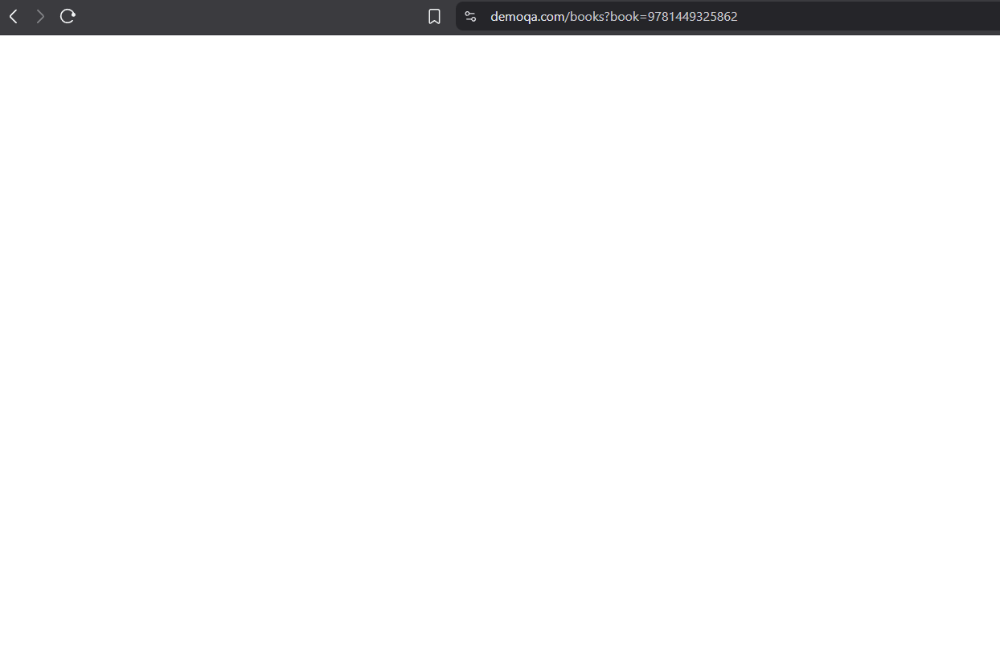
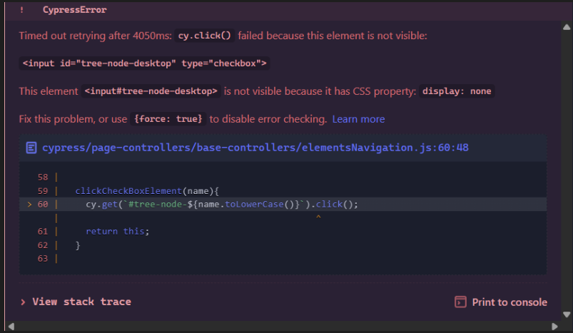

# DemoQA Defect Reports

## Defect 1: Book Information Page Not Loading

**Title**: Book title links fail to load book information page  
**Severity**: Medium  
**Status**: Open  
**Environment**: Production Web application  
**URL**: https://demoqa.com/books  
**Browser/OS**: Chrome/Windows (also reproduced in Cypress tests)  
**Version**: Current as of April 17, 2025  

### Description
if the user is on the DemoQA Book Store page
When the user clicks on the "Git Pocket Guide" book title or any book title,
The user is taken to a blank new page where the book information page should load


### Steps to Reproduce
1. Visit https://demoqa.com
2. Click the "Book Store Application" card
3. Make sure you are in the `Book Store` section of the `Book store applicataion` dropdown
4. Click on any of the book titles (e.g., "Git Pocket Guide")
5. [BUG]: the user is taken to a blank new page with no book information displayed.
### Expected Behavior
After clicking the book title, the book information should be displayed on the page.

### Actual Behavior
User is taken to a blank new page with no book information displayed.

### Impact
This issue prevents users from viewing detailed information about books, which is a core functionality of the Book Store application. While it doesn't affect the entire website functionality, it breaks a key feature of this section.

### Screenshots


---

## Defect 2: Hidden Checkbox Elements Causing Test Failures

**Title**: Checkbox display: none elements causing Cypress test failures  
**Severity**: Low  
**Status**: Open  
**Environment**: Testing environment  
**URL**: https://demoqa.com/elements  
**Browser/OS**: Electron 130 (Cypress)  
**Version**: Current as of April 17, 2025  

### Description
Cypress tests fail when attempting to interact with checkbox elements due to them being hidden with CSS `display: none`. This is causing automated test failures if `force: true` which is not ideal, as if the element is not actually visible or is covered by another element, the test will still pass, even if a user would be unable to interact with the checkbox

### Steps to Reproduce
1. Run elements-checkbox-test.cy.js suite with the `force: true` flag removed from the click checkbox methods
2. [BUG]: Observe error message:
```
CypressError: Timed out retrying after 4050ms: cy.click() failed because this element is not visible:
<input id="tree-node-desktop" type="checkbox">
```

### Expected Behavior
Cypress tests should be able to interact with checkbox elements if they are visually available

### Actual Behavior
Tests fail with timeout errors because Cypress cannot click on elements with `display: none` CSS property.

### Impact
This issue only affects automated testing and doesn't impact end users. However, it prevents reliable test automation of an important feature.

